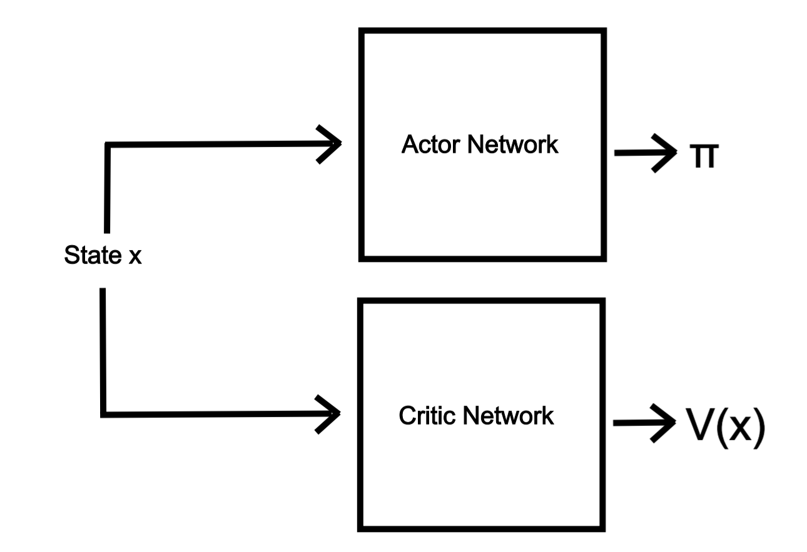

## References

[1] Liu, X. Y., Yang, H., Chen, Q., Zhang, R., Yang, L., Xiao, B., & Wang, C. D. (2020). FinRL: A deep reinforcement learning library for automated stock trading in quantitative finance. arXiv preprint arXiv:2011.09607.

[2] Liu, X. Y., Xiong, Z., Zhong, S., Yang, H., & Walid, A. (2018). Practical deep reinforcement learning approach for stock trading. arXiv preprint arXiv:1811.07522.

## Project Description

The idea was to create a stock trading bot that is able to buy and sell stocks using Deep Reinforcement Learning or RNNs. My final goal is to be able to connect the bot to a broker via an API (e.g. https://www.bybit.com/future-activity/en/developer). I want to experiment with different architectures and settle for the most promising one. Although predicting stock prices might prove to be challenging, I view it as a valuable learning experience.

### Dataset

The dataset consists of past stock prices, most of which are public knowledge

## Model Architecture

After my research, I chose to use an actor-critic network with PPO for this task, as PPO seemed very promising to me. The improvement I made to existing architectures, is that the network additionally uses RNNs which were used for trading purposes before the uprise of deep reinforcement learning. My aim was to combine both approaches.

The structure of a single network can be seen in 

The state x is passed to the recurrent network (can be of type RNN, LSTM or GRU) which can contain 1-4 layers. The output of that RNN is then passed to the fully connected network alongside the initial values. The actor-critic structure, in which both components individually conform to the prior architecture, is illustrated in 

## Error Metric

As predicting future stock prices can prove to be quite challenging, I did not set the goal of the trading bot to achieve any amount of profit, but rather want the agent to retain at least the same porfolio value as at the beginning in order to minimize risks. 

Sadly, the agent does not yet achieve this goal. However, I believe more training time and further random search might improve the models to achieve the desired results. 

## Demo Setup

Note that for the installation the python version 3.11 is needed

### Frontend

Run `npm install` in the frontend directory, to install the necessary node modules

Run `npm run dev` to start the frontend

### Backend

Install the necessary python dependencies

Run `python -m uvicorn backend:app --reload --host 0.0.0.0 --port 8000` in the src directory to start the backend server

### Alternative method

If all dependencies are installed, you can just execute the `start.bat` file
