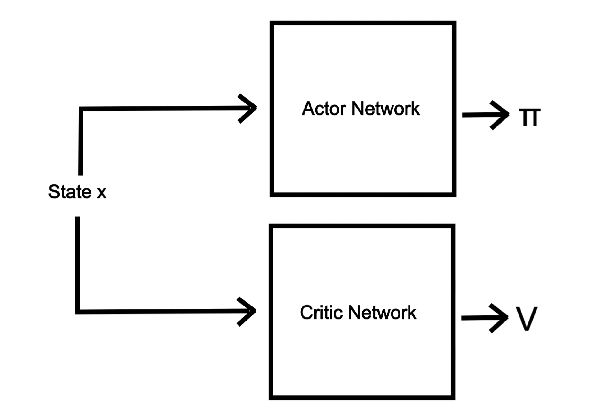

# Task 1
## 1. References

[1] Liu, X. Y., Yang, H., Chen, Q., Zhang, R., Yang, L., Xiao, B., & Wang, C. D. (2020). FinRL: A deep reinforcement learning library for automated stock trading in quantitative finance. arXiv preprint arXiv:2011.09607.

[2] Liu, X. Y., Xiong, Z., Zhong, S., Yang, H., & Walid, A. (2018). Practical deep reinforcement learning approach for stock trading. arXiv preprint arXiv:1811.07522.

## 2. Topic Choice

A stock trading bot 

## 3. Type of Project

Bring your own method

## 4. Summary

### a) Project Description

The idea is to create a stock trading bot that is able to buy and sell stocks using Deep Reinforcement Learning or RNNs. My goal is to be able to connect the bot to a broker via an API (e.g. https://www.bybit.com/future-activity/en/developer). I want to experiment with different architectures and settle for the most promising one. The next step is then trying to find ways to improve the architecture or algorithmic details. Although predicting stock prices might prove to be challenging, I view it as a valuable learning experience.

### b) Dataset

The dataset will consist of past stock prices, most of which are public knowledge, with one possible dataset source being https://www.marketdata.app/.

### c) Work-Breakdown + Time Estimations

- Searching for the best online data source and setting the data up - 3 hours
- Searching for different stock trading algorithms and architectures mainly in the DRL and RNN sectors - 15 hours
- Experimenting with the found architectures and selecting the most promising one - 20 hours
- Trying to find ways to improve the algorithm/architecture - 20 hours
- Training and fine-tuning the network - 20 hours
- Building an application - 20 hours
- Writing the final report - 10 hours
- Preparing the presentation - 5 hours

Sum of estimation: 113 hours

# Task 2

The work-breakdown for this task looked as follows:

- Searching for the correct dataset and downloading ~ 2 hours
- Data preprocessing and visualization ~ 3 hours 
- Reading into DRL, watching the lecture videos and researching different techniques ~ 20 hours
- Looking for and reading into DRL frameworks and implementations ~ 5 hours
- Setting up the environment and reading into openai gymnasium ~ 10 hours
- Reading into the PPO implementation and adapting it to run locally ~ 3 hours
- Adapting the agent to run with RNN as well as other optimizations (e.g. normalization) ~ 5 hours
- Setup for model training and random search ~ 3 hours (actual training time ~ 12 hours)
- Testing ~ 2 hours
- General debugging ~ 7 hours
- Documentation ~ 5 hours
- Validation ~ 2 hours

Sum ~ 65 hours

## Model Architecture

After my research, I chose to use an actor-critic network with PPO for this task, as PPO seemed very promising to me. The improvement I made to existing architectures, is that the network additionally uses RNNs which were used for trading purposes before the uprise of deep reinforcement learning. My aim was to combine both approaches.

The network structure can be seen in 

The state x is passed to the recurrent network (can be of type RNN, LSTM or GRU) which can contain 1-4 layers. The output of that RNN is then passed to the fully connected network alongside the initial values. The actor-critic structure can be seen in 

## Error Metric

As predicting future stock prices can prove to be quite challenging, I did set the goal of the trading bot to achieve any amount of profit, but rather want the agent to retain at least the same porfolio value as at the beginning in order to minimize risks. 

Sadly, the agent does not yet achieve this goal. However, I believe more training time and further random search might improve the models to achieve the desired results. 

